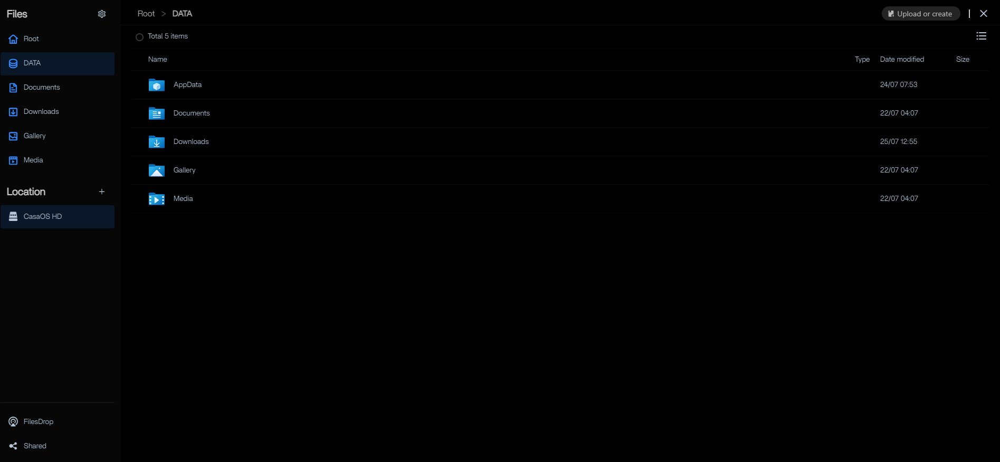
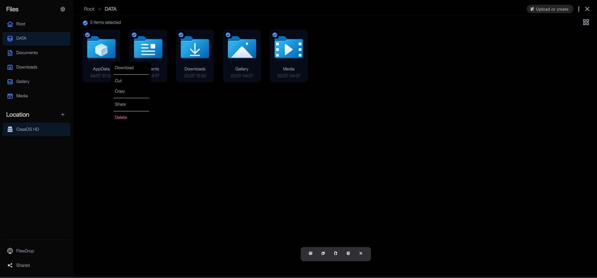
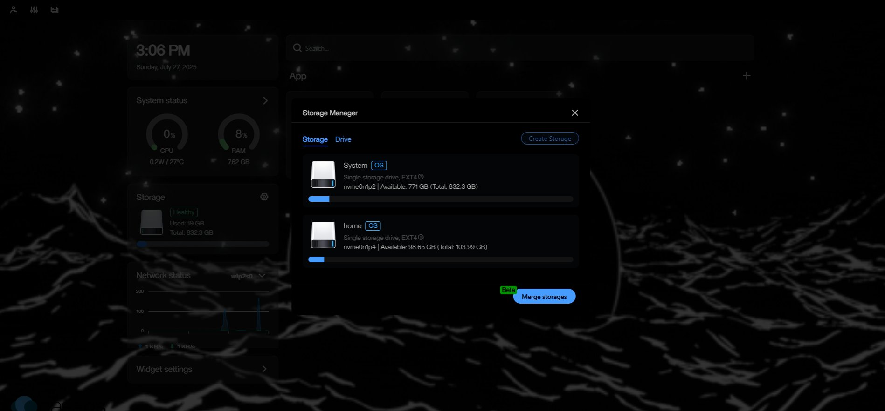
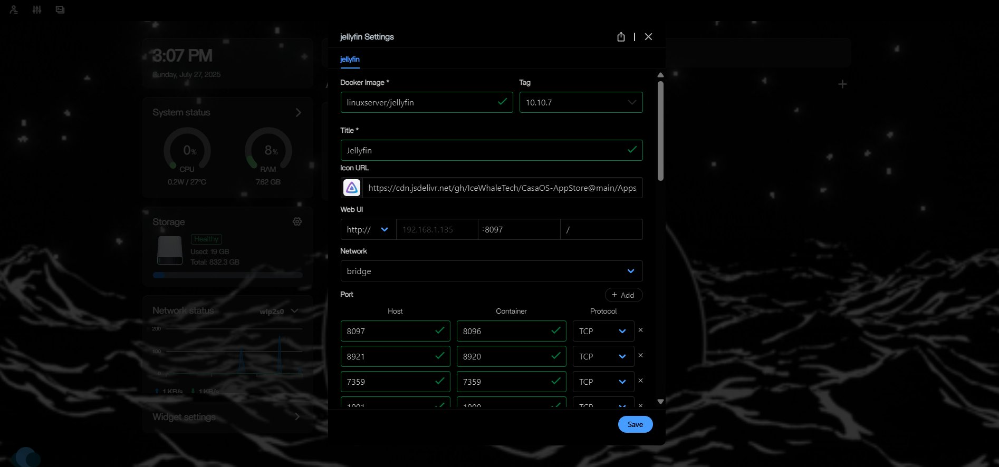
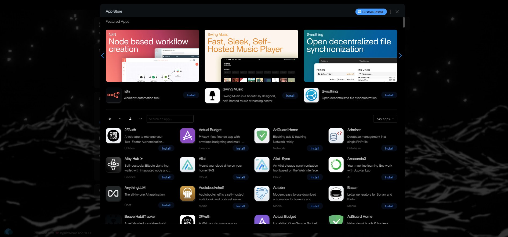

# CasaOS-DarkMode
Custom CSS theme for CasaOS, Work in Progress

use Stylus, Tampermonkey, or another UserStyle/UserScript/CSS manager

Optional (Commented out by default) - Hide CasaOS Log/Flexbar Links:

